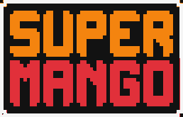

<div align="center">



# Super Mango

### A retro 2D platformer built with C++ and raylib

[](https://isocpp.org/)
[](https://www.raylib.com/)
[](#download-and-play)
[](https://github.com/MahmoudNagiubX/Super-Mango-Game/releases/tag/v1.0.0)
[](#project-status)

**Run, jump, collect coins, survive moving hazards, and reach the goal across two pixel-art levels.**

[Download v1.0.0](https://github.com/MahmoudNagiubX/Super-Mango-Game/releases/download/v1.0.0/Super-Mango-Windows-v1.0.0.zip)
·
[View release notes](https://github.com/MahmoudNagiubX/Super-Mango-Game/releases/tag/v1.0.0)
·
[Browse the source](./Super%20Mango%20Game%20Main)

</div>

---

## Overview

**Super Mango** is a side-scrolling platform game implemented in **C++14** with **raylib**. Instead of relying on a full game engine, the project implements its own gameplay loop, player movement, gravity, collision handling, camera tracking, tile rendering, enemy motion, scoring, audio, menus, and level progression.

The repository is presented as a complete small software product: source code, playable Windows release, screenshots, build instructions, architecture notes, and an engineering roadmap.

## Screenshots

### Main Menu

<p align="center">
  
</p>

### Level 1 — Outdoor Adventure

<p align="center">
  
</p>

### Level 2 — Castle Challenge

<p align="center">
  
</p>

## Engineering Highlights

- **Real-time application loop:** coordinates scenes, gameplay updates, rendering, audio, pausing, game-over handling, and the ending flow.
- **Custom player controller:** horizontal movement, sprint acceleration, jumping, gravity, boundaries, camera tracking, health, lives, and temporary damage immunity.
- **Tile-based levels:** each level is stored as a `17 × 130` character grid and rendered into 64-pixel terrain, platforms, hazards, and collectibles.
- **Collision system:** handles platforms, coins, spikes, moving saws, enemies, falls, level goals, and respawn behavior.
- **Sprite animation:** frame-based sprite-sheet animation with mirrored source rectangles for left/right movement.
- **Release delivery:** packages the executable, resources, runtime DLLs, license notice, and play instructions into a downloadable Windows ZIP.

## Gameplay

| System | Behavior |
|---|---|
| **Movement** | Move left/right, sprint, jump, and traverse a scrolling level |
| **Health and lives** | Three-hit health system, respawning, and a game-over sequence |
| **Scoring** | Coins increase the score; score milestones grant an extra life |
| **Enemies** | Birds, spiders, and animated flame hazards |
| **Environment** | Platforms, bridges, spikes, falls, and moving saws |
| **Progression** | Reach the star to complete the current level |
| **Audio** | Separate menu, level, and ending music with gameplay sound effects |

### Controls

| Input | Action |
|---|---|
| `A` | Move left |
| `D` | Move right |
| `Left Shift` | Sprint |
| `Space` | Jump |
| `Esc` | Pause or resume |
| `Q` | Return to the main menu while paused |

## Architecture

The codebase separates the main gameplay responsibilities into focused modules:

| Module | Responsibility |
|---|---|
| `main.cpp` | Application setup and top-level game loop |
| `Menu` | Splash animation, main menu, controls, pause UI, and ending screen |
| `Player` | Input, movement, physics, camera, health, lives, score, and HUD |
| `Levels` | Tile maps, drawing, collisions, coins, hazards, progression, and death flow |
| `Enemies` | Bird, spider, and flame movement plus reset behavior |
| `Animations` | Texture loading, sprite frames, animation timers, and entity rendering |

```text
Super-Mango-Game/
├── .github/workflows/release.yml
├── docs/assets/super-mango-logo.svg
├── Super Mango Game Main/
│   ├── Animations.cpp / Animations.h
│   ├── Enemies.cpp / Enemies.h
│   ├── Levels.cpp / Levels.h
│   ├── Menu.cpp / Menu.h
│   ├── Player.cpp / Player.h
│   ├── main.cpp
│   ├── Makefile
│   ├── Super Mango.vcxproj
│   ├── main.exe
│   └── resources/
└── README.md
```

## Download and Play

1. Download [`Super-Mango-Windows-v1.0.0.zip`](https://github.com/MahmoudNagiubX/Super-Mango-Game/releases/download/v1.0.0/Super-Mango-Windows-v1.0.0.zip).
2. Extract the complete ZIP archive.
3. Open the extracted folder.
4. Run `SuperMango.exe`.

> [!IMPORTANT]
> Keep `SuperMango.exe`, the included DLL files, and the `resources` directory together. The game loads its textures, sounds, music, and fonts through relative paths.

## Build from Source

### Requirements

- Windows 10 or later
- A C++14-compatible compiler
- raylib 4.5 or a compatible release
- Visual Studio 2022 or a raylib-configured MinGW/w64devkit environment

### Clone

```bash
git clone https://github.com/MahmoudNagiubX/Super-Mango-Game.git
cd Super-Mango-Game/"Super Mango Game Main"
```

### Visual Studio

Open `Super Mango.vcxproj`, configure the raylib include and library paths for your environment, select the required Windows target, and build.

### Command line

Run from `Super Mango Game Main` in a raylib-configured MinGW environment:

```bash
g++ -std=c++14 \
  main.cpp Menu.cpp Player.cpp Levels.cpp Enemies.cpp Animations.cpp \
  -o SuperMango.exe \
  -lraylib -lopengl32 -lgdi32 -lwinmm
```

Run the executable from the same directory as `resources/`.

## Next Engineering Improvements

- Replace frame-dependent movement with delta-time-based updates.
- Move level layouts from large C++ arrays into external map files.
- Add CMake and automated build validation for reproducible builds.
- Introduce RAII-based resource ownership and targeted tests for deterministic gameplay logic.

## Developer

### Mahmoud Nagiub

I am a Software Engineering student building practical projects across software engineering, AI systems, and systems-level development. This project highlights my foundation in **C++**, real-time application flow, interactive graphics, modular design, debugging, and packaging software for other people to run.

- GitHub: [@MahmoudNagiubX](https://github.com/MahmoudNagiubX)

## License and Asset Notes

The repository includes a license notice in [`Super Mango Game Main/LICENSE.txt`](./Super%20Mango%20Game%20Main/LICENSE.txt). raylib and any third-party visual, audio, font, or runtime assets remain subject to their respective licenses and attribution requirements.

---

<div align="center">

Built with C++ and raylib. 🥭

</div>
