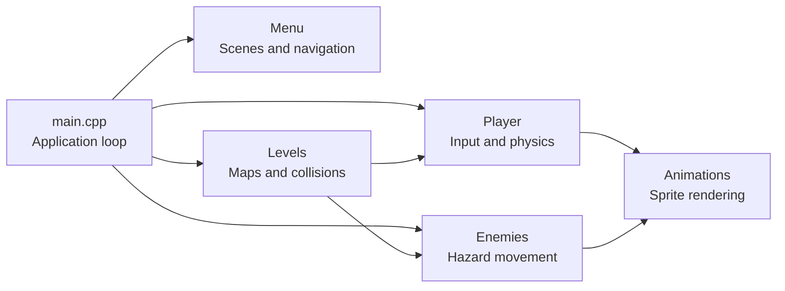

<div align="center">


# 🥭 Super Mango

### A handcrafted 2D platformer built with C++ and raylib

[](https://isocpp.org/)
[](https://www.raylib.com/)
[](#download-and-play)
[](https://github.com/MahmoudNagiubX/Super-Mango-Game/releases/latest)
[](./Super%20Mango%20Game%20Main/LICENSE.txt)

**Explore two pixel-art environments, collect coins, avoid enemies and traps, and reach the star at the end of each level.**

[Download the Windows demo](https://github.com/MahmoudNagiubX/Super-Mango-Game/releases/latest) · [Explore the code](./Super%20Mango%20Game%20Main) · [Report an issue](https://github.com/MahmoudNagiubX/Super-Mango-Game/issues)

</div>

---

## Overview

**Super Mango** is a retro-inspired 2D platform game developed in **C++14** using **raylib**. The project was built to explore the systems behind a platformer rather than relying on a full game engine.

The implementation covers the complete gameplay loop: menu navigation, player movement, animation, camera tracking, tile-based levels, collision handling, enemy behavior, hazards, scoring, audio, pausing, game-over recovery, and an ending sequence.

### Why this project matters

This repository demonstrates practical experience with:

- Object-oriented C++ design across focused gameplay modules
- Real-time game-loop and state-management logic
- Custom player physics and collision handling
- Sprite-sheet animation and frame-based timing
- Tile-map rendering for large, side-scrolling levels
- Camera, HUD, audio, and input integration with raylib
- Packaging a playable Windows build through GitHub Releases

---

## Screenshots

### Main Menu

<p align="center">
  
</p>

### Level 1 — Outdoor Adventure

<p align="center">
  
</p>

### Level 2 — Castle Challenge

<p align="center">
  
</p>

---

## Gameplay

The player must travel through two handcrafted levels while managing health and lives, collecting coins, and avoiding environmental and moving hazards.

| System | Implementation |
|---|---|
| **Movement** | Left/right movement, sprinting, jumping, gravity, and boundary checks |
| **Health** | Three-hit health system with temporary damage immunity |
| **Lives** | Respawn flow and game-over sequence when all lives are lost |
| **Scoring** | Coins award points; score milestones grant an extra life |
| **Enemies** | Birds, spiders, and animated flame hazards with level-specific movement |
| **Hazards** | Spikes, moving saws, falls, and enemy collisions |
| **Progression** | Reach the star to complete a level and unlock the next scene |
| **Audio** | Menu, level, ending music, and gameplay sound effects |

### Controls

| Input | Action |
|---|---|
| `A` | Move left |
| `D` | Move right |
| `Left Shift` | Sprint |
| `Space` | Jump |
| `Esc` | Pause or resume |
| `Q` | Return to the main menu while paused |

---

## Download and Play

### Recommended: Windows release

1. Open the [latest GitHub Release](https://github.com/MahmoudNagiubX/Super-Mango-Game/releases/latest).
2. Download `Super-Mango-Windows-v1.0.0.zip`.
3. Extract the entire ZIP file.
4. Run `SuperMango.exe` from the extracted folder.

> [!IMPORTANT]
> Keep the `resources` directory and the included DLL files beside the executable. The game loads textures, audio, and fonts using relative paths.

The release is a **playable Windows demo** containing both levels and the current complete gameplay flow.

---

## Architecture

The codebase separates gameplay responsibilities into six primary modules:



| Module | Responsibility |
|---|---|
| `main.cpp` | Initializes raylib and coordinates the complete application/game loop |
| `Menu` | Splash animation, main menu, controls screen, pause UI, and ending screen |
| `Player` | Input, movement, sprinting, jumping, gravity, camera, health, lives, and HUD |
| `Levels` | Tile maps, rendering, coins, collision resolution, hazards, progression, and death flow |
| `Enemies` | Bird, spider, and flame movement behavior plus enemy resets |
| `Animations` | Sprite-sheet source rectangles, animation timers, and entity rendering |

### Project structure

```text
Super-Mango-Game/
├── .github/
│   └── workflows/
│       └── release.yml
├── Super Mango Game Main/
│   ├── Animations.cpp / Animations.h
│   ├── Enemies.cpp / Enemies.h
│   ├── Levels.cpp / Levels.h
│   ├── Menu.cpp / Menu.h
│   ├── Player.cpp / Player.h
│   ├── main.cpp
│   ├── Makefile
│   ├── Super Mango.vcxproj
│   ├── main.exe
│   └── resources/
│       ├── audio/
│       └── graphics/
└── README.md
```

---

## Technical Details

### Tile-based level system

Each level is represented as a `17 × 130` character grid. Individual characters map to terrain, platforms, bridges, spikes, coins, or empty space. The renderer converts those symbols into 64-pixel tiles, while the collision system uses the same map as its gameplay source of truth.

### Player physics

Movement and jumping are implemented directly in the game loop. The player uses horizontal speed, sprint acceleration, vertical jump velocity, gravity accumulation, foot collision checks, and a side-scrolling `Camera2D` target.

### Collision and damage

The game combines raylib rectangle collision helpers with a custom overlap check for rotated or offset hazards. Damage reduces the player's health and starts an immunity timer so a single contact does not remove all health instantly.

### Animation system

Characters and hazards use sprite sheets. Source rectangles advance through animation frames using dedicated timers, while negative source widths mirror sprites to face the opposite direction.

---

## Build from Source

### Requirements

- Windows 10 or later
- A C++14-compatible compiler
- [raylib](https://www.raylib.com/) 4.5 or a compatible version
- Visual Studio 2022 **or** the raylib Windows `w64devkit` toolchain

### Clone the repository

```bash
git clone https://github.com/MahmoudNagiubX/Super-Mango-Game.git
cd Super-Mango-Game/"Super Mango Game Main"
```

### Visual Studio

Open `Super Mango.vcxproj`, configure your raylib include/library paths, select the desired Windows target, and build the project.

### Command-line example

Run this from `Super Mango Game Main` in a raylib-configured MinGW environment:

```bash
g++ -std=c++14 \
  main.cpp Menu.cpp Player.cpp Levels.cpp Enemies.cpp Animations.cpp \
  -o SuperMango.exe \
  -lraylib -lopengl32 -lgdi32 -lwinmm
```

Run the resulting executable from the same directory so it can locate `resources/`.

---

## Engineering Roadmap

The current release is a complete playable demo. Natural next improvements include:

- Move level data from C++ arrays into external map files
- Replace frame-dependent motion with delta-time-based movement
- Introduce RAII wrappers for textures, sounds, fonts, and music
- Add CMake for reproducible cross-platform builds
- Add unit tests for map parsing, scoring, and collision calculations
- Add settings for resolution, audio volume, and key remapping
- Expand the game with additional levels and enemy behaviors

---

## Developer

### Mahmoud Nagiub

Software Engineering student building practical projects across **software engineering, AI systems, and systems-level development**. Super Mango represents my work with C++, real-time application architecture, interactive graphics, and complete product delivery from source code to a downloadable release.

- GitHub: [@MahmoudNagiubX](https://github.com/MahmoudNagiubX)

---

## License and Credits

This repository includes an [MIT License](./Super%20Mango%20Game%20Main/LICENSE.txt). raylib and all third-party visual or audio assets remain subject to their respective original licenses and attribution requirements.

---

<div align="center">

Built with C++ and raylib — from game loop to playable release. 🥭

If the project helped or interested you, consider giving the repository a star.

</div>
